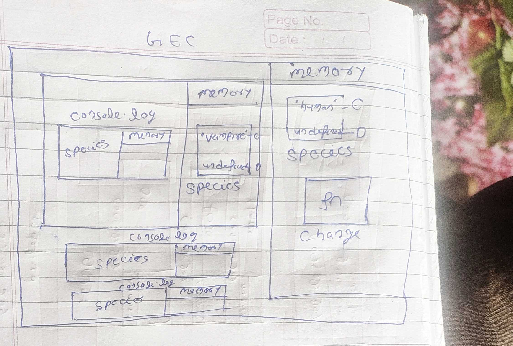
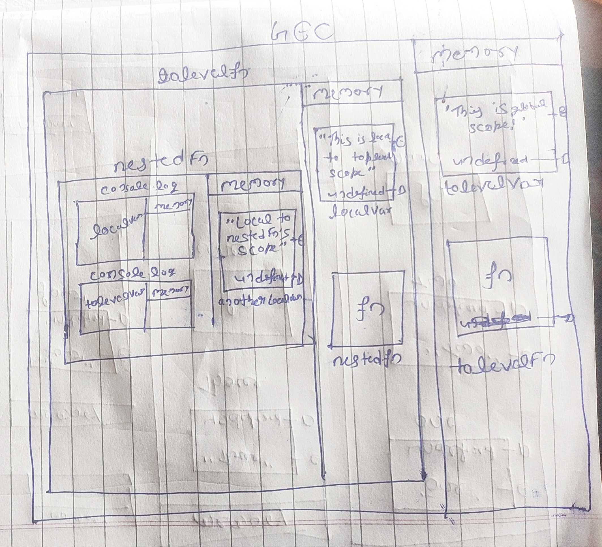

Create a execution context diagram of the following code on your notebook. Take a screenshot/photo and store it in the folder named `img`. Use `` to display it here.

- Take in account the different phases of execution, different execution contexts

1.

```js
var species = "human";

function change() {
  var species = "vampire";
  console.log(species);
}

console.log(species); // "human"
change();
console.log(species); // "human"
```

<!-- Put your image below -->



- Create the execution context diagram
- What will be the value of species on 1 and 2

2.

```js
var topLevelVar = "This is global scope!";

function topLevelFn() {
  var localVar = "This is local to topLevelFn's scope";

  function nestedFn() {
    var anotherLocalVar = "Local to nestedFn's scope.";

    console.log(localVar); // "This is local to topLevelFn's scope";
    console.log(topLevelVar); // "This is global scope!";
  }

  nestedFn();
}

topLevelFn();
```

<!-- Put your image below -->



- Create the execution context diagram
- What will be the value of 1 and 2

3.

```js
var one = "One";
var two = "Two";

function main() {
  var three = "Three";

  function inner() {
    var four = "Four";

    console.log(one); // "One"
    console.log(two); // "Two"
    console.log(three); // "Three"
  }
  console.log(four); // undefined
  inner();
}

main();
console.log(one, two, three, four); // four is not defined
```

<!-- Put your image below -->

;

- Create the execution context diagram
- What will be the value of 1, 2, 3, 4 and 5 or error if the code does not work
